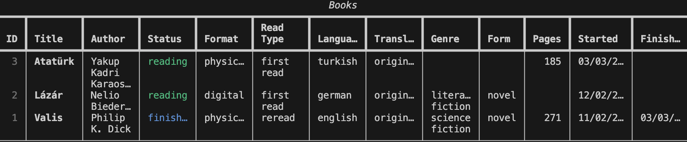
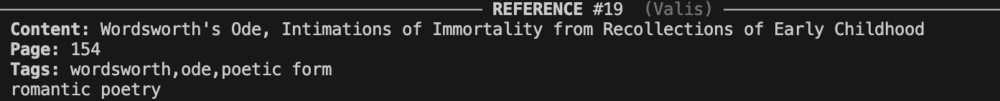
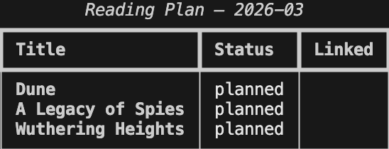

# book-agent

A personal reading companion for the terminal. I built this tool purely because it was something I wanted to exist. This is how I read and would like to track my reading, store my impressions from my readings, and would like to remember the references.

Track quotes, references, concepts, and notes as you read — with optional AI-powered expansions via Ollama. Your data lives in `~/.book-agent/books.db`, a local SQLite database that never touches the cloud.

## Requirements

- Python 3.13+
- [uv](https://github.com/astral-sh/uv)
- [Ollama](https://ollama.com) (optional — only needed for `--expand`, `--from-image`, and `retag`)

## Installation

```bash
git clone https://github.com/tsabanoglu/book-agent
cd book-agent
uv sync
uv run book-agent --help
```

## Demo

The following walkthrough uses *Valis* by Philip K. Dick as an example.

### 1. Add a book

```bash
uv run book-agent book add "Valis" \
  --author "Philip K. Dick" \
  --format physical \
  --language english \
  --genre "science fiction" \
  --form novel \
  --pages 227 \
  --started 2026-01-10
```

### 2. Fill in missing details

If you added a book in a hurry and left fields blank, use `book edit` to update them afterwards. Only the fields you pass are changed; everything else stays as-is.

```bash
# quick add — just the essentials
uv run book-agent book add "Valis" --author "Philip K. Dick"

# fill in the rest when you have time
uv run book-agent book edit "Valis" \
  --format physical \
  --language english \
  --genre "science fiction" \
  --form novel \
  --pages 227 \
  --started 2026-01-10
```

### 3. List your books

```bash
uv run book-agent book list
```



### 4. Add entries while reading

**Save a quote:**
```bash
uv run book-agent add quote "Valis" \
  --content "The empire never ended." \
  --page 14
```

**Log a reference:**
```bash
uv run book-agent add reference "Valis" \
  --content "Wordsworth's Ode, Intimations of Immortality from Recollections of Early Childhood" \
  --page 154
```

**Log a concept:**
```bash
uv run book-agent add concept "Valis" \
  --content "Gnostic dualism" \
  --page 85 \
  --context "Dick frames his breakdown through the lens of the Nag Hammadi texts"
```

**Add a note:**
```bash
uv run book-agent add note "Valis" \
  --content "PKD self-references Do Androids Dream of Electric Sheep." \
  --page 168
```

### 5. List entries for a book

```bash
# all entries
uv run book-agent list "Valis"

# filter by type
uv run book-agent list "Valis" --type reference
```

### 6. Search across all books

```bash
uv run book-agent search "Wordsworth"
```



### 7. Expand a reference with Ollama

```bash
# expand entry #5 on the spot
uv run book-agent expand 5

# or expand at the time of adding
uv run book-agent add reference "Valis" \
  --content "Heraclitus's concept of flux" \
  --page 201 \
  --expand
```

Ollama will explain the reference on its own terms — no speculation about the book.

### 8. Add an entry from a photo

Point your phone at a page, then:

```bash
uv run book-agent add quote "Valis" --from-image ~/Desktop/page1.jpg
```

The vision model extracts the text; you confirm, edit, or abort before it's saved.

### 9. Auto-tag references and concepts

```bash
# tag entries that are missing tags
uv run book-agent retag

# re-tag everything, including already-tagged entries
uv run book-agent retag --all
```

### 10. Reading plan

```bash
# add books to your monthly plan
uv run book-agent plan add "Valis" "The Man in the High Castle"

# check the plan
uv run book-agent plan list



# update status
uv run book-agent plan status "Valis" finished

# carry an unfinished book to next month
uv run book-agent plan carry "The Man in the High Castle"

# view stats
uv run book-agent plan stats
uv run book-agent plan stats --all
```

### 11. Change a book's read status

```bash
# mark as finished (sets finished_at to today on first use; safe to re-run)
uv run book-agent book status "Valis" finished

# mark as currently reading
uv run book-agent book status "Valis" reading

# pause a book
uv run book-agent book status "Valis" paused
```

Valid statuses: `reading`, `finished`, `paused`. The `finished_at` date is only set once — re-running `finished` will not overwrite the original date.

## Direct database access

The database lives at `~/.book-agent/books.db`. You can query it directly with `sqlite3`:

```bash
sqlite3 -column -header ~/.book-agent/books.db
```

Example — find every book that references Wordsworth:

```sql
SELECT b.title, e.content, e.page, e.tags
FROM entries e
JOIN books b ON e.book_id = b.id
WHERE e.entry_type = 'reference'
  AND (e.content LIKE '%Wordsworth%' OR e.tags LIKE '%Wordsworth%');
```


## Entry types

| Type | Use for |
|---|---|
| `quote` | Exact words from the text |
| `reference` | A person, work, or idea the author mentions |
| `concept` | A theme or idea worth unpacking |
| `note` | Your own thoughts about the book |

## Roadmap

- [ ] As the database grows, the idea is to create a graph-like structure across all books based on themes, references, genres, and concepts. A personal knowledge map of everything I've/you've read, if you will.

## Ollama models

The app uses two local models by default:

| Purpose | Model |
|---|---|
| Tag generation & expansion | `phi3` |
| Image text extraction | `minicpm-v` |

Pull them before using AI features:

```bash
ollama pull phi3
ollama pull minicpm-v
```
